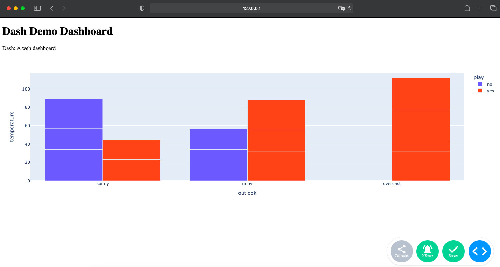

# Dashboarding

## Dash
### `Setup`

- https://dash.plotly.com/installation

### `Basic Example`

- https://dash.plotly.com/layout

### `Dashboard Templates`

- https://dash.gallery/Portal/

### `Dash Dashboards Serving`
```text
Dash is running on http://127.0.0.1:8050/

 * Serving Flask app 'Dash_Demo'
 * Debug mode: on
```
- Dashboard Demo
